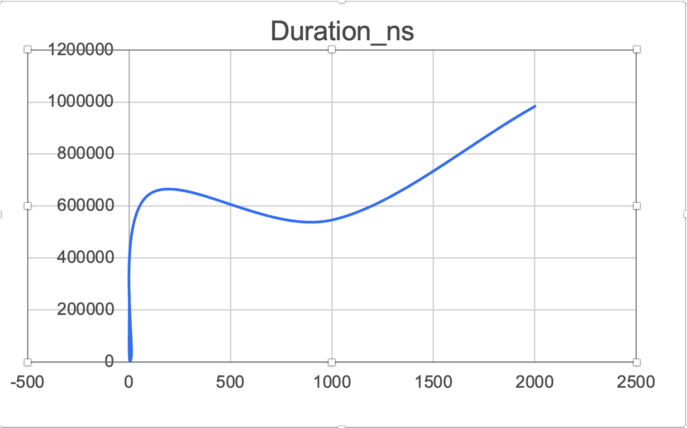
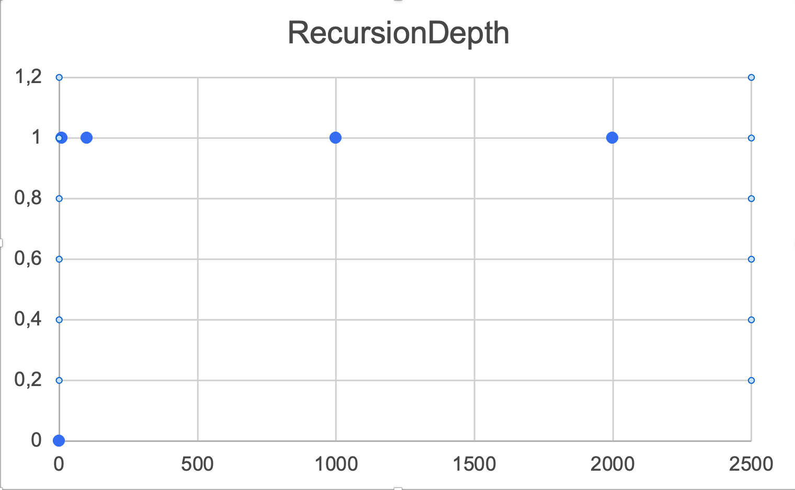
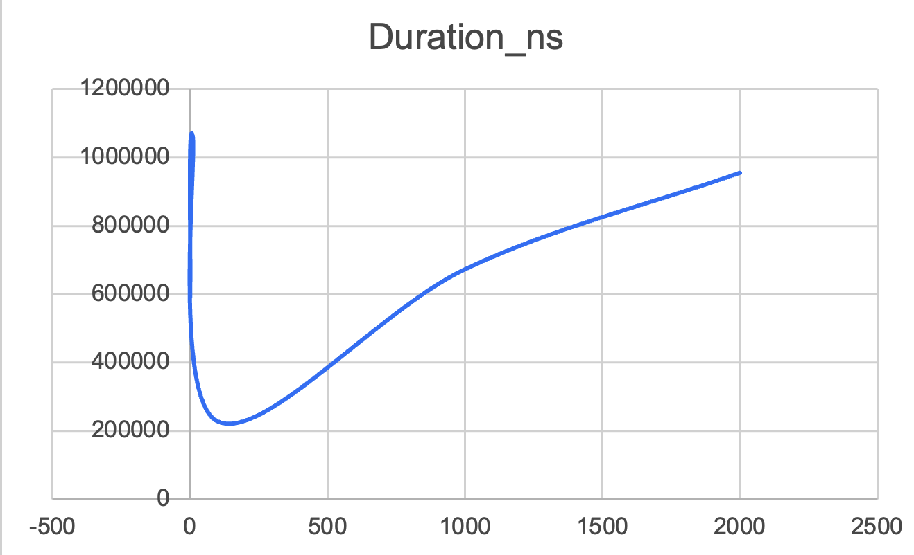
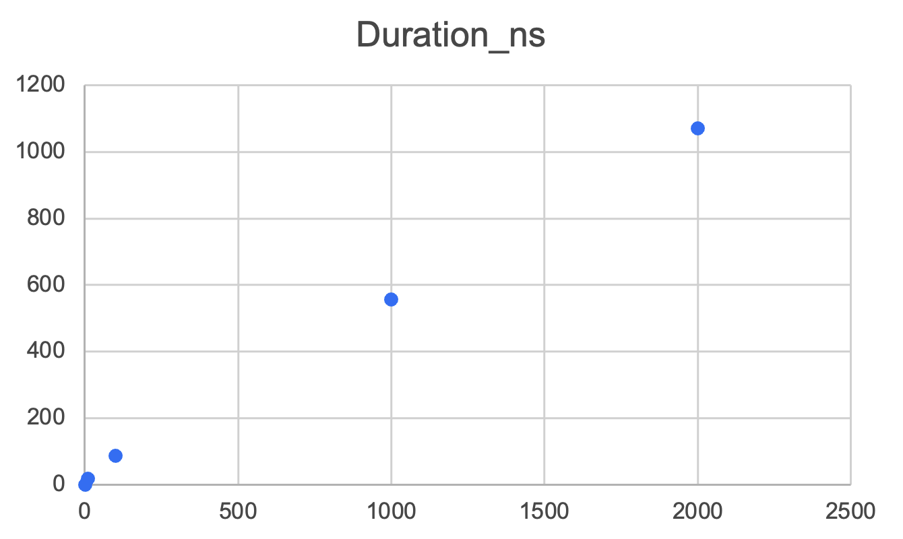
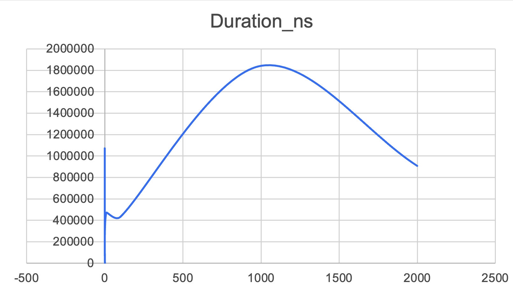
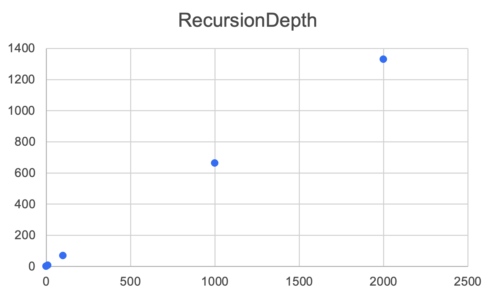
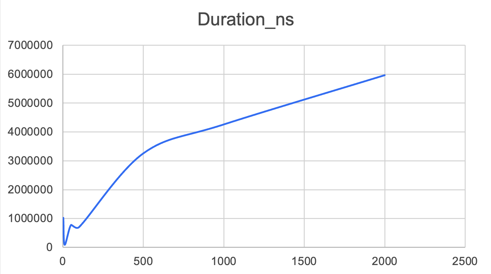
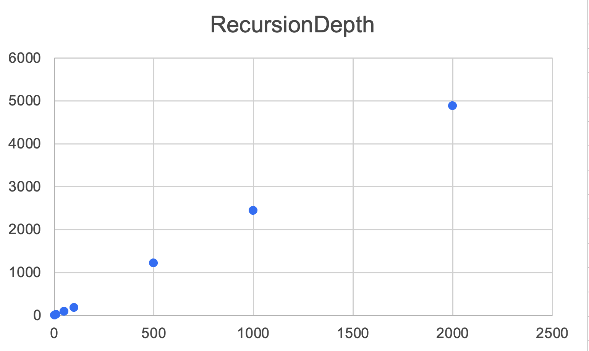

# Algorithm Lab: Divide-and-Conquer Benchmarks

This project implements classic divide-and-conquer algorithms in Java 17, with safe recursion patterns, performance metrics collection, and validation against theoretical expectations.

## 1. Architecture Notes

The algorithms are implemented using classic divide-and-conquer strategies with optimizations to control recursion depth and memory usage:

- **MergeSort**
    - Uses divide-and-conquer, recursion depth ≈ log₂(n)
    - Reusable buffer array to reduce allocations
    - Small arrays (n < 10) use Insertion Sort to reduce overhead

- **QuickSort**
    - Randomized pivot selection
    - Recurses on the smaller partition to limit stack depth
    - Recursion depth ≤ 2·log₂(n) on average

- **Deterministic Select (MoM5)**
    - Groups of 5 elements for median-of-medians pivot
    - Recurse only into the side containing the k-th element
    - Recursion depth ≈ log₂(n)

- **Closest Pair of Points**
    - Divide-and-conquer on x-coordinates
    - Strip check examines ≤ 7 neighbors for closest pair
    - Recursion depth ≈ log₂(n)

## 2. Recurrence Analysis

For each algorithm, the recurrence, analysis method, and resulting complexity are summarized below:

- **MergeSort**
    - Recurrence: T(n) = 2T(n/2) + Θ(n)
    - Master Theorem, Case 2 → Θ(n log n)
    - Recursion depth matches log₂(n), execution time aligns with theory

- **QuickSort**
    - Recurrence: T(n) = T(U) + T(n-U-1) + Θ(n), where U is the pivot index
    - Randomized pivot gives expected Θ(n log n), worst-case Θ(n²)
    - Smaller-first recursion bounds recursion depth ≤ 2·log₂(n)

- **Deterministic Select (MoM5)**
    - Recurrence: T(n) = T(n/5) + T(≤7n/10) + Θ(n)
    - Solved using Akra–Bazzi → Θ(n)
    - Recursion depth ≈ log₂(n)

- **Closest Pair of Points (2D)**
    - Recurrence: T(n) = 2T(n/2) + Θ(n)
    - Master Theorem, Case 2 → Θ(n log n)
    - Strip check adds a constant factor, depth ≈ log₂(n)

### 3. Graphs and visualizations
The graphs show how the execution time and the depth of recursion vary depending on the size of the input data, which gives an idea of the performance of each algorithm.

## MergeSort

- **Time vs n**

- **Recursion Depth vs n**

---

## QuickSort

- **Time vs n**

- **Recursion Depth vs n**

---

## Deterministic Select (MoM5)

- **Time vs n**

- **Recursion Depth vs n**

---

## Closest Pair of Points

- **Time vs n**

- **Recursion Depth vs n**

### 4. Summary

- Compare theory and measurement results:

- Merge sort and quick sort: Θ(n log n), measurement results meet expectations.

- Quick sort is usually faster than merge sort, with the same asymptotic growth due to smaller constant factors.
- 

- MoM5 Select scales linearly, slower for small n, but more efficient for large n.

- The nearest pair corresponds to an increase of n log n; constant coefficients make it more complex compared to other algorithms.

